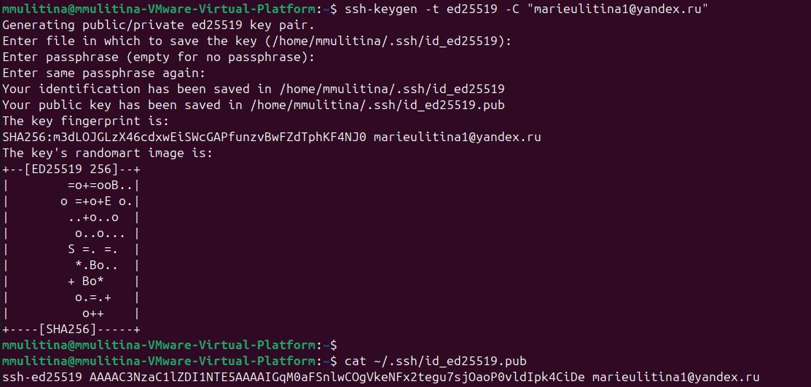
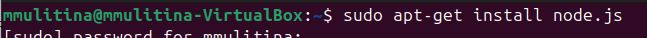
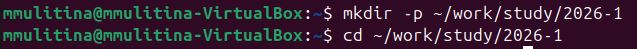
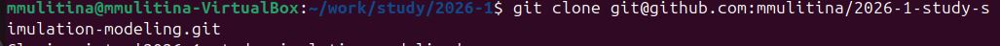
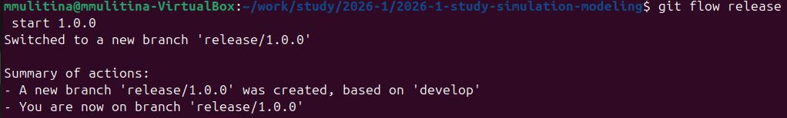
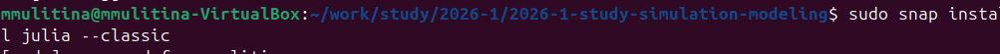
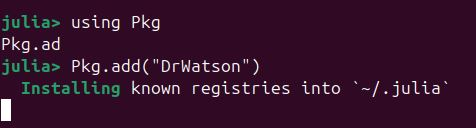
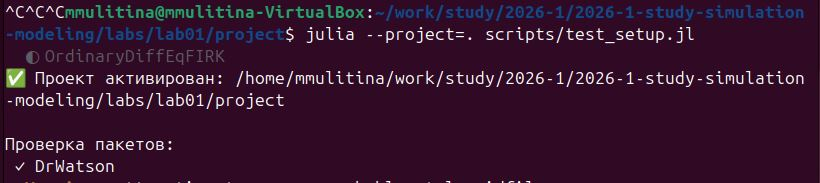

---
## Author
author:
  name: Мария Улитина
  email: marieulitina1@yandex.ru
  affiliation:
    - name: Российский университет дружбы народов
      country: Российская Федерация
      postal-code: 117198
      city: Москва
      address: ул. Миклухо-Маклая, д. 6
## Title
title: "Лабораторная работа №1"
subtitle: "Модель экспоненциального роста. Подготовка стенда и реализация модели"
license: CC BY
date: today
date-format: "YYYY-MM-DD"
---

# Информация

## Докладчик

:::::::::::::: {.columns align=center}
::: {.column width="70%"}

  * Улитина Мария
  * Студентка
  * Российский университет дружбы народов им. П. Лумумбы
  * [marieulitina1@yandex.ru](mailto:marieulitina1@yandex.ru)

:::
::: {.column width="30%"}


:::
::::::::::::::

# Вводная часть

## Актуальность

- Моделирование экспоненциальных процессов — основа для изучения сложных динамических систем
- Необходимость в организации воспроизводимого научного рабочего пространства
- Автоматизация подготовки отчётов через литературное программирование повышает эффективность исследований

## Объект и предмет исследования

- **Объект:** Процесс подготовки среды для имитационного моделирования
- **Предмет:** Модель экспоненциального роста, инструменты Git, Julia, DrWatson, Literate

## Цели и задачи

**Цель:** Освоение практических навыков подготовки рабочего пространства и реализация модели экспоненциального роста.

**Задачи:**
1. Настроить Git, SSH, Git Flow, репозиторий на GitHub
2. Установить Julia, DrWatson и необходимые пакеты
3. Реализовать и задокументировать модель роста

## Материалы и методы

- **Git / Git Flow** — контроль версий и ветвление
- **Julia** — язык для научных вычислений
- **DrWatson.jl** — фреймворк для научных проектов
- **Literate.jl** — литературное программирование
- **Quarto** — генерация итогового отчёта

# Ход выполнения работы

## Установка и настройка Git

- Установлен Git (рис. 1)
- Настроены `user.name` и `user.email` (рис. 2)
- Выполнена базовая конфигурация (рис. 3)
- Сгенерирован SSH-ключ для GitHub (рис. 4)




## Установка инструментов автоматизации

- Установлены Node.js, npm, yarn (рис. 5, 6, 8)
- Установлен pnpm (рис. 9–10)
- Установлен Git Flow (рис. 11)




## Организация рабочего пространства

- Создана структура по соглашению Denote (рис. 12)
- Клонирован репозиторий курса (рис. 13)
- Выполнена инициализация через Makefile (рис. 14)
- Изменения отправлены на GitHub (рис. 15)




## Внедрение Git Flow

- Инициализирован Git Flow (рис. 16)
- Созданы ветки `develop`, `master`, опубликованы на GitHub (рис. 17)
- Создан релиз 1.0.0 (рис. 18)
- Сгенерирован и закоммичен `CHANGELOG.md` (рис. 19–21)




## Установка Julia и DrWatson

- Установлен Julia через snap (рис. 22)
- В среде Julia установлен DrWatson.jl (рис. 24)
- Инициализирован проект DrWatson с именем `project` (рис. 25)
- Установлены необходимые пакеты (рис. 26)




## Тестирование окружения

- Создан тестовый скрипт `test_setup.jl` (рис. 27)
- Скрипт успешно выполнен (рис. 28)
- Подготовка стенда завершена (рис. 29)



# Реализация модели

## Модель экспоненциального роста

**Уравнение:**  
$$ \frac{du}{dt} = \alpha u $$

**Аналитическое решение:**  
$$ u(t) = u_0 e^{\alpha t} $$

**Параметры модели:**
- $u_0 = 1.0$ — начальное значение
- $\alpha = 0.5$ — коэффициент роста
- $t = 0:0.1:10$ — временной интервал

## Код модели (файл `02_exponential_growth.jl`)

```julia
using DrWatson
@quickactivate
using Plots

function exponential_growth(u0, α, t)
    return u0 * exp(α * t)
end

u0 = 1.0
α = 0.5
t = 0:0.1:10

u = exponential_growth.(u0, α, t)

plot(t, u, label="u(t) = u0 * exp(αt)", 
     xlabel="Время (t)", ylabel="Величина (u)", 
     title="Экспоненциальный рост", lw=2)
```

## Результаты

- Модель успешно реализована и протестирована
- Построен график экспоненциального роста
- Скрипт преобразован в формат литературного программирования через Literate.jl
- Интегрирован в итоговый отчёт Quarto

# Элементы презентации

## Ключевые навыки

- Настройка Git и Git Flow для управления научным проектом
- Работа с Julia и DrWatson для организации воспроизводимых исследований
- Литературное программирование как способ интеграции кода и отчёта


