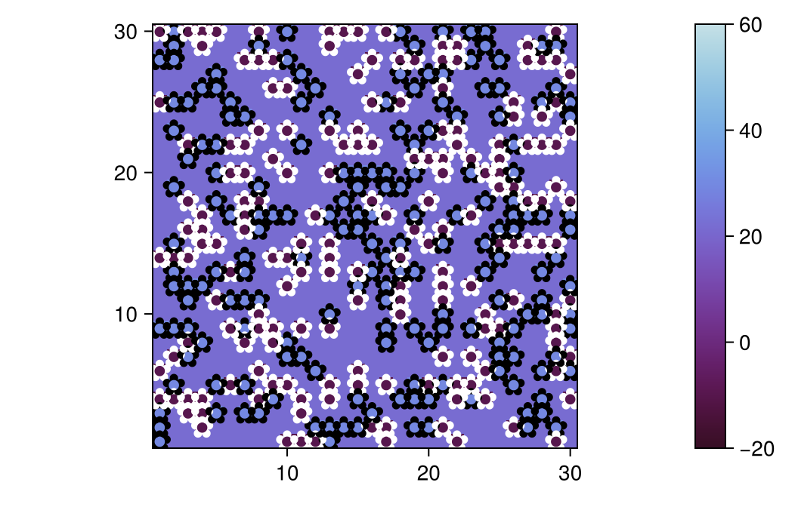
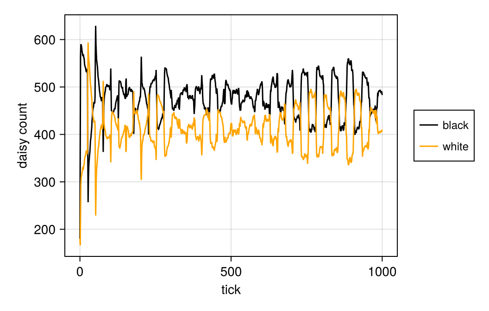

---
## Author
author:
  name: Улитина Мария Мксимовна
  degrees: студентка

  affiliation:
    - name: Российский университет дружбы народов
      country: Российская Федерация
      postal-code: 117198
      city: Москва
      address: ул. Миклухо-Маклая, д. 6
## Title
title: Лабораторная работа №3
subtitle: Презентация
license: CC BY
date: today
date-format: "YYYY-MM-DD" # Example: 2025-09-06
---

# Информация

## Докладчик

:::::::::::::: {.columns align=center}
::: {.column width="70%"}

  * Улитина Мария Максимовна
  * студентка

:::
::::::::::::::

# Вводная часть

## Актуальность

Агентный подход к имитационному моделированию (Agent-Based Modeling, ABM) — это метод исследования сложных систем, в котором поведение системы возникает из взаимодействия множества автономных сущностей, называемых агентами. Вместо того чтобы описывать систему глобальными уравнениями, мы моделируем каждую индивидуальную единицу и правила её поведения, а затем наблюдаем, какие коллективные паттерны появляются снизу вверх. Этот подход особенно полезен, когда поведение системы трудно предсказать из-за нелинейностей, гетерогенности участников или адаптивных стратегий.

## Объект и предмет исследования

В Julia основным инструментом является пакет Agents.jl, который предоставляет гибкую инфраструктуру для создания ABM, включая различные типы пространств, визуализацию и сбор данных. В других языках популярны NetLogo (специализированный язык), Mesa (Python), AnyLogic и др.

## Цели и задачи

- Создать разные агентные модели.

## Созданние необходимых файлов

## Пример визуализации

Посмотрим на пример визуализации 

## Сравнение количества ромашек

Посмотрим на график

