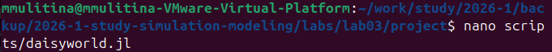
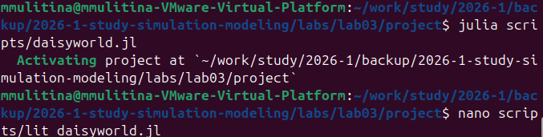

---
## Author
author:
  name: Улитина Мария Максимовна
  degrees: студентка
  
  affiliation:
    - name: Российский университет дружбы народов
      country: Российская Федерация
      postal-code: 117198
      city: Москва
      address: ул. Миклухо-Маклая, д. 6

## Title
title: "Лабораторная работа №3"
subtitle: "Простейший вариант"
license: "CC BY"
---

# Цель работы

Агентный подход к имитационному моделированию (Agent-Based Modeling, ABM) — это метод исследования сложных систем, в котором поведение системы возникает из взаимодействия множества автономных сущностей, называемых агентами. Вместо того чтобы описывать систему глобальными уравнениями, мы моделируем каждую индивидуальную единицу и правила её поведения, а затем наблюдаем, какие коллективные паттерны появляются снизу вверх. Этот подход особенно полезен, когда поведение системы трудно предсказать из-за нелинейностей, гетерогенности участников или адаптивных стратегий.

# Задание

Реализовать различные агентные модели.

# Теоретическое введение

Основные принципы агентного моделирования

 - Эмерджентность: глобальное поведение системы не закладывается явно, а возникает из локальных взаимодействий. Это позволяет открывать неожиданные закономерности.
 - Автономия: агенты действуют независимо, на основе своей внутренней логики.
 - Гетерогенность: агенты могут различаться по своим характеристикам и правилам, что отражает реальное разнообразие.
 - Локальность: чаще всего агенты обладают информацией только о своём ближайшем окружении.

# Выполнение лабораторной работы

Создадим все необходимые файлы, запустим их, а также создадим файлы с литературным кодом([рис. @fig-001]).

{#fig-001 width=70%}

([рис. @fig-002]).

{#fig-002 width=70%}

([рис. @fig-003]).

{#fig-003 width=70%}

([рис. @fig-004]).

{#fig-004 width=70%}

([рис. @fig-005]).

{#fig-005 width=70%}

([рис. @fig-006]).

{#fig-006 width=70%}

([рис. @fig-007]).

{#fig-007 width=70%}

([рис. @fig-008]).

{#fig-008 width=70%}

([рис. @fig-009]).

{#fig-009 width=70%}

Скомпилируем файлы для литературного стиля ([рис. @fig-010]).

{#fig-010 width=70%}

# Выводы

Было проделано моделирование.

# Список литературы{.unnumbered}

::: {#refs}
@article{Datseris2022,
    author = {Datseris, G. and Vahdati, A. R. and DuBois, T. C.},
    title = {Agents.jl: a performant and feature-full agent-based modeling software of minimal code complexity},
    journal = {SIMULATION},
    publisher = {SAGE Publications},
    year = {2022},
    pages = {003754972110688}
}

@article{Watson1983,
    author = {Watson, A. J. and Lovelock, J. E.},
    title = {Biological homeostasis of the global environment: the parable of Daisyworld},
    journal = {Tellus B: Chemical and Physical Meteorology},
    publisher = {Stockholm University Press},
    year = {1983},
    volume = {35},
    number = {4},
    pages = {284}
}

@article{Wood2008,
    author = {Wood, A. J. and others},
    title = {Daisyworld: A review},
    journal = {Reviews of Geophysics},
    publisher = {American Geophysical Union (AGU)},
    year = {2008},
    volume = {46},
    number = {1}
}
:::
