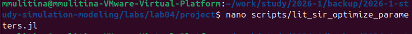

---
## Author
author:
  name: Улитина Мария Мксимовна
  degrees: студентка

  affiliation:
    - name: Российский университет дружбы народов
      country: Российская Федерация
      postal-code: 117198
      city: Москва
      address: ул. Миклухо-Маклая, д. 6
## Title
title: Лабораторная работа №4
subtitle: Презентация
license: CC BY
date: today
date-format: "YYYY-MM-DD" # Example: 2025-09-06
---

# Информация

## Докладчик

:::::::::::::: {.columns align=center}
::: {.column width="70%"}

  * Улитина Мария Максимовна
  * студентка

:::
::::::::::::::

# Вводная часть

## Актуальность

Создадим агентную модель распространения инфекционного заболевания на основе классической компартментальной модели SIR (Susceptible-Infectious-Recovered). Модель будет реализована с использованием пакета Agents.jl. В отличие от классической модели на дифференциальных уравнениях, агентный подход позволит учесть индивидуальные характеристики, пространственную структуру и стохастичность процессов.

## Цели и задачи

- Создать разные агентные модели.

# Выполнение лабораторной работы

## Создадим необходимый файл в src.

## Создадим базовый эксперимент, запустим его и создадим литературный код.

## Проведем  сканирование коэффициента заразности и составим скрипт, запустим его и создадим литературный код.

## Проведем многокритериальную оптимизацию параметров и составим скрипт, запустим его и создадим литературный код.

## Запусти визуализацию

## Скомпилируем файлы для литературного стиля.

{#fig-012 width=70%}

