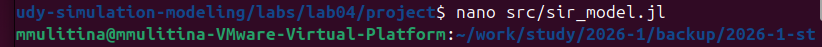
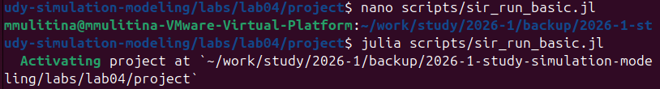
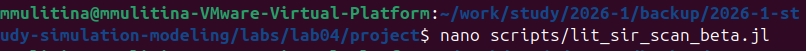
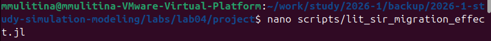
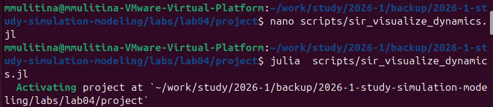

# Информация

## Докладчик

- Улитина Мария Максимовна
- Студентка

---

# Вводная часть

## О модели

Создадим агентную модель распространения инфекционного заболевания на основе классической компартментальной модели **SIR** (Susceptible-Infectious-Recovered).

Модель будет реализована с использованием пакета **Agents.jl**.

## Преимущества агентного подхода

В отличие от классической модели на дифференциальных уравнениях, агентный подход позволит учесть:

- индивидуальные характеристики
- пространственную структуру
- стохастичность процессов

---

# Цель работы

## Цель

- Создать разные агентные модели.

---

## Создание необходимых файлов

Создадим необходимый файл в директории `src`.

## Базовый эксперимент

Создадим базовый эксперимент, запустим его и создадим литературный код.

## Сканирование коэффициента заразности

Проведем сканирование коэффициента заразности и составим скрипт, запустим его и создадим литературный код.

Литературный код результатов сканирования.

## Многокритериальная оптимизация параметров

Проведем многокритериальную оптимизацию параметров и составим скрипт.

Запустим скрипт оптимизации.

Создадим литературный код для оптимизации.

## Визуализация

Запустим визуализацию модели.

## Компиляция

Скомпилируем файлы для литературного стиля.

# Выводы

Было проделано моделирование.

# Заключение

## Результаты

В ходе лабораторной работы были созданы агентные модели распространения инфекционного заболевания с использованием пакета Agents.jl.
