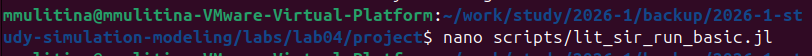
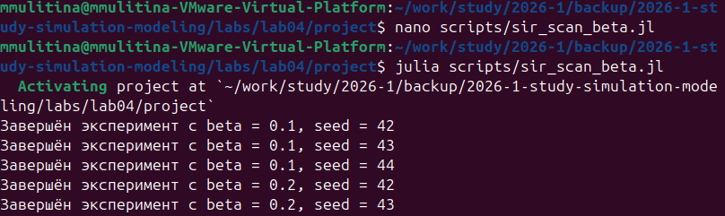
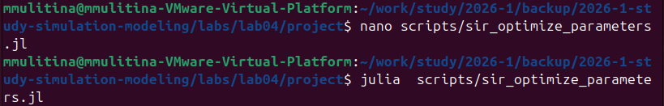
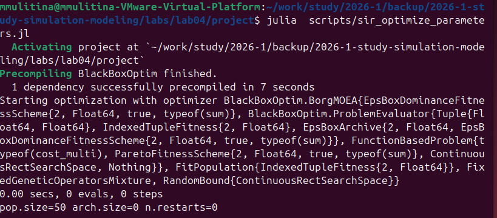
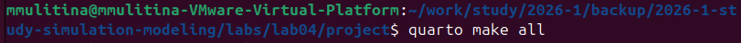

---
## Author
author:
  name: Улитина Мария Максимовна
  degrees: студентка
  
  affiliation:
    - name: Российский университет дружбы народов
      country: Российская Федерация
      postal-code: 117198
      city: Москва
      address: ул. Миклухо-Маклая, д. 6

## Title
title: "Лабораторная работа №4"
subtitle: "Простейший вариант"
license: "CC BY"
---

# Цель работы

Создадим агентную модель распространения инфекционного заболевания на основе классической компартментальной модели SIR (Susceptible-Infectious-Recovered). Модель будет реализована с использованием пакета Agents.jl. В отличие от классической модели на дифференциальных уравнениях, агентный подход позволит учесть индивидуальные характеристики, пространственную структуру и стохастичность процессов.

# Задание

Реализовать различные агентные модели.

# Теоретическое введение

Модель SIR, предложенная Кермаком и Маккендриком в 1927 году, описывает динамику эпидемии в популяции, разделённой на три группы:

  - (Susceptible) — восприимчивые к заболеванию индивиды;
  - (Infectious) — инфицированные, способные заражать восприимчивых;
 -  (Recovered) — выздоровевшие (или умершие), получившие иммунитет и более не участвующие в распространении.

# Выполнение лабораторной работы

Создадим необходимый файл в src ([рис. @fig-001]).

{#fig-001 width=70%}

Создадим базовый эксперимент, запустим его и создадим литературный код ([рис. @fig-002]).

{#fig-002 width=70%}

([рис. @fig-003]).

{#fig-003 width=70%}

Проведем  сканирование коэффициента заразности и составим скрипт, запустим его и создадим литературный код ([рис. @fig-004]).

{#fig-004 width=70%}

([рис. @fig-005]).

{#fig-005 width=70%}

Проведем многокритериальную оптимизацию параметров и составим скрипт, запустим его и создадим литературный код ([рис. @fig-008]).

{#fig-008 width=70%}

([рис. @fig-009]).

{#fig-009 width=70%}

([рис. @fig-010]).

{#fig-010 width=70%}

Запусти визуализацию ([рис. @fig-011]).

{#fig-011 width=70%}

Скомпилируем файлы для литературного стиля ([рис. @fig-012]).

{#fig-012 width=70%}

# Выводы

Было проделано моделирование.

# Список литературы{.unnumbered}

::: {#refs}
@article{Datseris2022,
    author = {Datseris, G. and Vahdati, A. R. and DuBois, T. C.},
    title = {Agents.jl: a performant and feature-full agent-based modeling software of minimal code complexity},
    journal = {SIMULATION},
    publisher = {SAGE Publications},
    year = {2022},
    pages = {003754972110688}
}

@article{Watson1983,
    author = {Watson, A. J. and Lovelock, J. E.},
    title = {Biological homeostasis of the global environment: the parable of Daisyworld},
    journal = {Tellus B: Chemical and Physical Meteorology},
    publisher = {Stockholm University Press},
    year = {1983},
    volume = {35},
    number = {4},
    pages = {284}
}

@article{Wood2008,
    author = {Wood, A. J. and others},
    title = {Daisyworld: A review},
    journal = {Reviews of Geophysics},
    publisher = {American Geophysical Union (AGU)},
    year = {2008},
    volume = {46},
    number = {1}
}
:::
