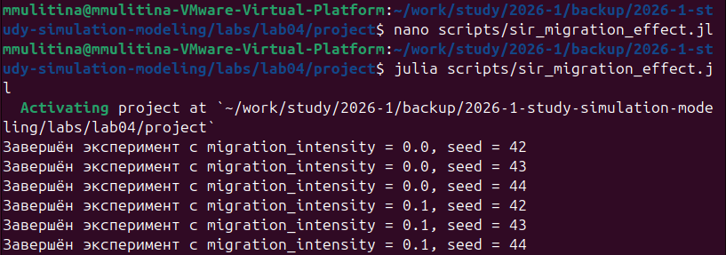

---
author:
  name: Улитина Мария Максимовна
  degrees: студентка
  affiliation:
    - name: Российский университет дружбы народов
      country: Российская Федерация
      postal-code: 117198
      city: Москва
      address: ул. Миклухо-Маклая, д. 6
title: "Лабораторная работа №4"
subtitle: "Модель распространения инфекционного заболевания (SIR)"
license: "CC BY"
format:
  pdf:
    toc: true
    number-sections: true
  html:
    toc: true
    code-fold: true
jupyter: julia-1.9
---

# Цель работы

Создать агентную модель распространения инфекционного заболевания на основе классической компартментальной модели SIR (Susceptible-Infectious-Recovered). Модель будет реализована с использованием пакета Agents.jl. В отличие от классической модели на дифференциальных уравнениях, агентный подход позволит учесть индивидуальные характеристики, пространственную структуру и стохастичность процессов.

# Задание

Реализовать различные агентные модели, включая базовый эксперимент SIR, сканирование коэффициента заразности и многокритериальную оптимизацию параметров.

# Теоретическое введение

Модель SIR, предложенная Кермаком и Маккендриком в 1927 году, описывает динамику эпидемии в популяции, разделённой на три группы:

- **S (Susceptible)** — восприимчивые к заболеванию индивиды;
- **I (Infectious)** — инфицированные, способные заражать восприимчивых;
- **R (Recovered)** — выздоровевшие (или умершие), получившие иммунитет и более не участвующие в распространении.

Основные принципы агентного моделирования применительно к эпидемиологии:

- **Эмерджентность**: глобальная динамика эпидемии возникает из локальных взаимодействий между агентами.
- **Автономия**: каждый агент действует независимо на основе своего состояния (S, I или R).
- **Гетерогенность**: агенты могут различаться по степени восприимчивости, подвижности или контактности.
- **Локальность**: заражение происходит только при контакте с инфицированными агентами в ближайшем окружении.

# Выполнение лабораторной работы

## Создание необходимых файлов

Создадим необходимый файл в директории `src` (@fig-001).

{#fig-001 width=70%}

## Базовый эксперимент

Создадим базовый эксперимент, запустим его и создадим литературный код (@fig-002).

{#fig-002 width=70%}

Литературный код для базового эксперимента (@fig-003).

{#fig-003 width=70%}

## Сканирование коэффициента заразности

Проведем сканирование коэффициента заразности и составим скрипт, запустим его и создадим литературный код (@fig-004).

{#fig-004 width=70%}

Литературный код результатов сканирования (@fig-005).

{#fig-005 width=70%}

## Многокритериальная оптимизация параметров

Проведем многокритериальную оптимизацию параметров и составим скрипт (@fig-006).

{#fig-006 width=70%}

Запустим скрипт оптимизации (@fig-007).

{#fig-007 width=70%}

Создадим литературный код для оптимизации (@fig-008).

{#fig-008 width=70%}

## Визуализация

Запустим визуализацию модели (@fig-011).

{#fig-011 width=70%}

## Компиляция

Скомпилируем файлы для литературного стиля (@fig-012).

{#fig-012 width=70%}

# Выводы

Было проделано моделирование.

# Список литературы{.unnumbered}

::: {#refs}
@article{Datseris2022,
    author = {Datseris, G. and Vahdati, A. R. and DuBois, T. C.},
    title = {Agents.jl: a performant and feature-full agent-based modeling software of minimal code complexity},
    journal = {SIMULATION},
    publisher = {SAGE Publications},
    year = {2022},
    pages = {003754972110688}
}

@article{Watson1983,
    author = {Watson, A. J. and Lovelock, J. E.},
    title = {Biological homeostasis of the global environment: the parable of Daisyworld},
    journal = {Tellus B: Chemical and Physical Meteorology},
    publisher = {Stockholm University Press},
    year = {1983},
    volume = {35},
    number = {4},
    pages = {284}
}

@article{Wood2008,
    author = {Wood, A. J. and others},
    title = {Daisyworld: A review},
    journal = {Reviews of Geophysics},
    publisher = {American Geophysical Union (AGU)},
    year = {2008},
    volume = {46},
    number = {1}
}
:::
