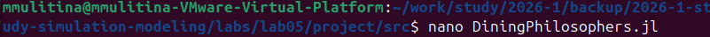
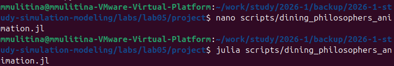
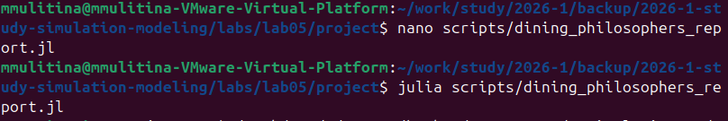

---
## Author
author:
  name: Улитина Мария Максимовна
  affiliation:
    - name: Российский университет дружбы народов
      country: Российская Федерация
      postal-code: 117198
      city: Москва
      address: ул. Миклухо-Маклая, д. 6
## Title
title: Лабораторная работа №5. Аппарат сетей Петри
subtitle: Презентация
license: CC BY
date: today
date-format: "2026-04-18"
---

- Информация

## Докладчик

:::::::::::::: {.columns align=center}
::: {.column width="70%"}

  * Улитина Мария Максимовна
  * студентка НФИбд-02-23

:::
::::::::::::::

# Вводная часть

## Цель работы

 - Построить сеть Петри для пяти философов, моделируя захват и освобождение вилок.

 - Обнаружить состояние взаимной блокировки (deadlock), когда каждый философ взял одну вилку и ждёт вторую.

 - Провести имитационное моделирование (стохастическое и детерминированное) и выявить наличие deadlock.

 - Модифицировать сеть, чтобы предотвратить deadlock.

 - Проанализировать результаты и оформить отчёт с графиками и анимацией.

## Задание 

 - Создать рабочий каталог для кода.
 - Установить необходимые пакеты.
 - Выполнить предложенный код.
 - Преобразовать код в литературный стиль.
 - Сгенерировать из литературного кода: чистый код; jupyter notebook; документацию в формате Quarto.
 - Выполнить код из jupyter notebook.
 
## Задание (продолжение)

 - Интегрировать документацию в формате Quarto в отчёт.
 - Добавить в код в литературном стиле вычисление для набора параметров.
 - Сгенерировать из литературного кода с параметрами:
чистый код; jupyter notebook; документацию в формате Quarto.
 - Выполнить код из jupyter notebook с параметрами.
 - Интегрировать документацию с параметрами в формате Quarto в отчёт.

# Выполнение работы

## Создание кода модели
 
Создадим файл с необходимыми функциями и моделью

## Базовое моделирование

Проведем базовое моделирование, запустим код модели 

## Анимация

Создадим скрипт, который будет создавать анимацию 

## Отчет

Создадим скрипт, который будет создавать отчет для анализа работы модели.

## Литературный код

Создадим файлы для литературного кода.

## Отчет

Сгенерируем отчет.

## Выводы

В ходе работы были полностью выполнены все задачи, сформулированные в разделе "Задачи".
