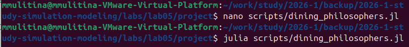
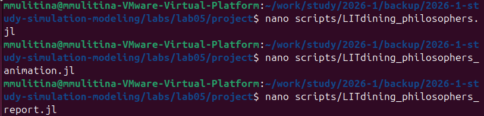
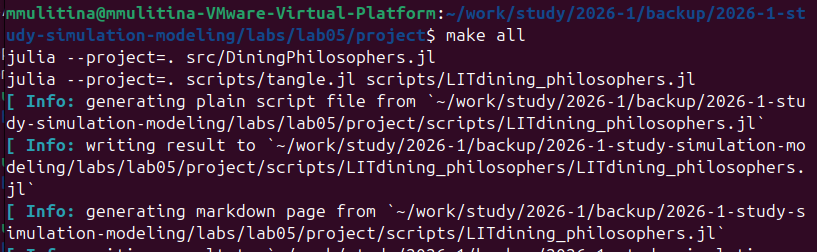

---
## Author
author:
  name: Улитина Мария Максимовна
  affiliation:
    - name: Российский университет дружбы народов
      country: Российская Федерация
      postal-code: 117198
      city: Москва
      address: ул. Миклухо-Маклая, д. 6

## Title
title: "Лабораторная работа №5. Аппарат сетей Петри"
subtitle: "Отчет"
license: "CC BY"
---

# Цель работы

Построить сеть Петри для пяти философов, моделируя захват и освобождение вилок.

Обнаружить состояние взаимной блокировки (deadlock), когда каждый философ взял одну вилку и ждёт вторую.

Провести имитационное моделирование (стохастическое и детерминированное) и выявить наличие deadlock.

Модифицировать сеть, чтобы предотвратить deadlock.

Проанализировать результаты и оформить отчёт с графиками и анимацией.

# Задание

Создать рабочий каталог для кода.
Установить необходимые пакеты.
Выполнить предложенный код.
Преобразовать код в литературный стиль.
Сгенерировать из литературного кода: чистый код; jupyter notebook;
документацию в формате Quarto.
Выполнить код из jupyter notebook.
Интегрировать документацию в формате Quarto в отчёт.
Добавить в код в литературном стиле вычисление для набора параметров.
Сгенерировать из литературного кода с параметрами:
чистый код; jupyter notebook; документацию в формате Quarto.
Выполнить код из jupyter notebook с параметрами.
Интегрировать документацию с параметрами в формате Quarto в отчёт.

# Теоретическое введение

Сеть Петри есть математический аппарат для моделирования дискретных систем. Графически она представляется как двудольный ориентированный граф двух типов вершин: позиции (круги) и переходы (прямоугольники).

Позиции (Places) суть пассивные элементы, описывающие состояние системы (например, наличие ресурса или выполнение условия).
Внутри позиции могут находиться фишки (tokens) — неотрицательное целое число, указывающее на количество ресурсов.
Переходы (Transitions) суть активные элементы, описывающие события или действия системы.
Они могут срабатывать, изменяя состояние модели.
Дуги (Arcs) суть направленные соединения между позициями и переходами (но не между двумя позициями или двумя переходами), которые показывают, как состояние влияет на события и наоборот.
Маркировка (Marking) есть распределение фишек по позициям в определённый момент времени, то есть текущее состояние модели.
Смена маркировок происходит при срабатывании переходов в соответствии с определёнными правилами.
Теория сетей Петри, появившаяся как инструмент для анализа химических процессов, сегодня является мощным и наглядным математическим аппаратом. Она незаменима везде, где нужно описать параллельные, асинхронные и распределённые системы. В её основе лежат всего четыре элемента, а богатство поведения возникает из их комбинации.

# Выполнение лабораторной работы

Создадим файл с необходимыми функциями и моделью ([рис. @fig-001]).

{#fig-001 width=70%}

Проведем базовое моделирование, запустим код модели ([рис. @fig-002]).

{#fig-002 width=70%}

Создадим скрипт, который будет создавать анимацию  ([рис. @fig-003]).

{#fig-003 width=70%}

Создадим скрипт, который будет создавать отчет для анализа работы модели ([рис. @fig-004]).

{#fig-004 width=70%}

Создадим файлы для литературного кода ([рис. @fig-005]).

{#fig-005 width=70%}

Сгенерируем отчет ([рис. @fig-006]).

{#fig-006 width=70%}

# Выводы

В ходе работы были полностью выполнены все задачи, сформулированные в разделе "Задачи".

# Список литературы{.unnumbered}

1. Таненбаум Э., Бос Х. Современные операционные системы. — 4-е изд. — СПб. : Питер, 2015. — 1120 с. — (Классика Computer Science).

2. Robbins A. Bash Pocket Reference. — O'Reilly Media, 2016. — 156 p. — ISBN 978-1491941591.

3. Zarrelli G. Mastering Bash. — Packt Publishing, 2017. — 502 p. — ISBN 978-1784396879.

4. Newham C. Learning the bash Shell: Unix Shell Programming. — O'Reilly Media, 2005. — 354 p. — (In a Nutshell). — ISBN 0596009658.
