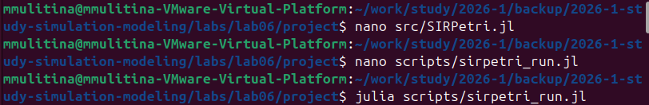
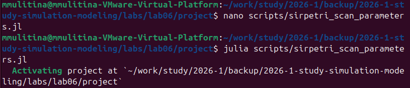
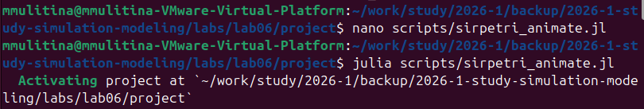
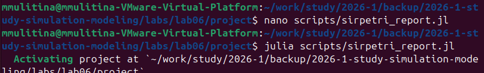
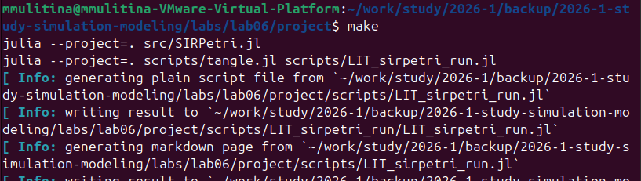

---
## Author
author:
  name: Улитина Мария Максимовна
  affiliation:
    - name: Российский университет дружбы народов
      country: Российская Федерация
      postal-code: 117198
      city: Москва
      address: ул. Миклухо-Маклая, д. 6

## Title
title: "Лабораторная работа №6"
subtitle: "Отчет"
license: "CC BY"
---

# Цель работы

Реализовать модель эпидемии SIR.
 
# Задание

Создать рабочий каталог для кода.
Установить необходимые пакеты.
Выполнить предложенный код.
Преобразовать код в литературный стиль.
Сгенерировать из литературного кода: чистый код; jupyter notebook; документацию в формате Quarto.
Выполнить код из jupyter notebook.
Интегрировать документацию в формате Quarto в отчёт.
Добавить в код в литературном стиле вычисление для набора параметров.
Сгенерировать из литературного кода с параметрами:
чистый код;
jupyter notebook;
документацию в формате Quarto.
Выполнить код из jupyter notebook с параметрами.
Интегрировать документацию с параметрами в формате Quarto в отчёт.

# Выполнение лабораторной работы 

Создадим базовый скрипт ([рис. @fig-001]).

{#fig-001 width=70%}

Запустим базовый прогон модели ([рис. @fig-002]).

{#fig-002 width=70%}

Запустим прогон модели c анимацией ([рис. @fig-003]).

{#fig-003 width=70%}

Запустим прогон модели c отчетом ([рис. @fig-004]).

{#fig-004 width=70%}

Создадим литературный код ([рис. @fig-005]).

{#fig-005 width=70%}

# Выводы

Реализована модель эпидемии SIR.

# Список литературы{.unnumbered}

::: {#refs}
:::
