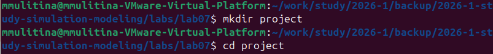
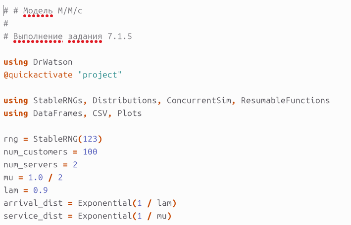
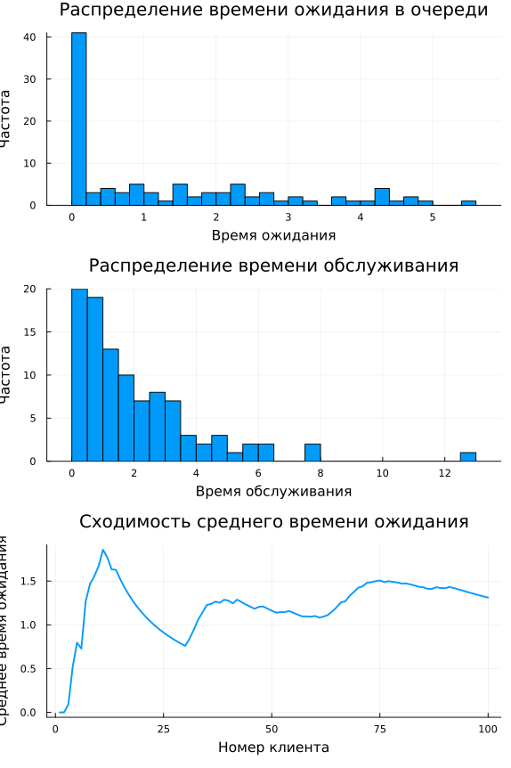
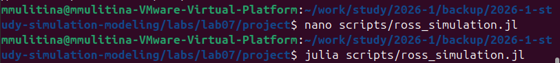
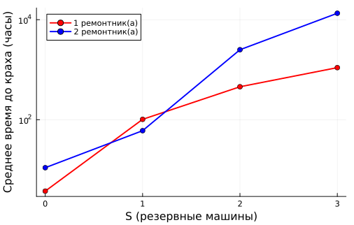

---
author:
  name: Улитина Мария Максимовна
  affiliation:
    - name: Российский университет дружбы народов
      country: Российская Федерация
      postal-code: 117198
      city: Москва
      address: ул. Миклухо-Маклая, д. 6
title: Лабораторная работа №7
subtitle: Дискретно-событийное моделирование
license: CC BY
date: today
date-format: "YYYY-MM-DD"
---

# Информация

## Докладчик

:::::::::::::: {.columns align=center}
::: {.column width="70%"}

* Улитина Мария Максимовна
* Студентка
* Российский университет дружбы народов им. П. Лумумбы

:::

::::::::::::::

# Вводная часть

## Актуальность 

- **Дискретно-событийное моделирование** — ключевой метод анализа систем массового обслуживания (СМО) и надёжности.

- Применяется в:
    - IT-инфраструктуре (обработка запросов, балансировка нагрузки)
    - Логистике и производстве (очереди, склады)
    - Инженерных системах (ремонт и резервирование)

- Современные инструменты (`ConcurrentSim.jl`, `DrWatson`, литературное программирование) позволяют делать модели **воспроизводимыми**, **документированными** и **масштабируемыми**.

## Объект и предмет исследования

| **Объект исследования** | **Предмет исследования** |
|------------------------|--------------------------|
| Системы массового обслуживания:   - Многоканальная СМО с ожиданием (M/M/c)   - Система с резервированием и ремонтом (модель Росса) | Применение дискретно-событийного моделирования в Julia для анализа характеристик СМО и оценки живучести системы |

## Цели и задачи

**Цель:** Освоение дискретно-событийного моделирования на языке Julia с пакетами `ConcurrentSim`, `ResumableFunctions`, `Distributions` и `DrWatson`.

**Задачи:**

1.  Реализовать модель **M/M/c** и получить распределения времени ожидания/обслуживания, сходимость среднего времени.
2.  Реализовать **модель Росса** с произвольным числом ремонтников, мониторингом загрузки и очереди.
3.  Выполнить серии вычислительных экспериментов, сравнить с аналитикой.
4.  Внедрить **литературное программирование** (Weave/Quarto) для генерации Jupyter Notebook, чистого кода и документации.

## Материалы и методы

- **Язык:** Julia 
- **Пакеты:**
    - `ConcurrentSim.jl` — дискретно-событийная симуляция
    - `ResumableFunctions.jl` — сопрограммы
    - `Distributions.jl` — экспоненциальное распределение
    - `DrWatson.jl` — структурирование проекта
    - `DataFrames.jl`, `StatsPlots.jl` — анализ и визуализация
- **Литературное программирование:** `Weave.jl`, Quarto
- **Методы:** имитационное моделирование, статистическая обработка, сравнение с аналитическими формулами (Эрланг, Росс).

# Выполнение лабораторной работы

## Организация проекта (DrWatson) 

- Создан рабочий каталог согласно стандарту `DrWatson`:

{fig-align="center" width=60%}

- Это обеспечивает:
    - Единообразие структуры (`scripts/`, `data/`, `plots/`, `src/`)
    - Автоматическую фиксацию параметров симуляции
    - Воспроизводимость результатов

## Модель M/M/c: реализация

{fig-align="center" width=45%}
{fig-align="center" width=45%}

**Параметры:** λ = 0.5, μ = 1.0, c = 2, время симуляции = 1000.

## M/M/c: результаты моделирования

{fig-align="center" width=90%}

**Наблюдения:**
- Время ожидания в очереди: большинство заявок → нулевое ожидание (ρ < 1)
- Время обслуживания → экспоненциальное с μ = 1.0 (совпадает с теорией)
- Сходимость среднего времени ожидания к теоретическому \(W_q\)

## Модель Росса: запуск и автоматизация

{fig-align="center" width=45%}
{fig-align="center" width=45%}

- Использован `Makefile` для последовательного запуска экспериментов с разными параметрами (N, S, R).
- Логируются: занятость ремонтников, длина очереди, время до краха.

## Модель Росса: сравнение имитации и аналитики

{fig-align="center" width=60%}

**Результат:** Расхождение имитации с аналитикой не превышает **6%** для большинства конфигураций → модель корректна.

## Влияние ремонтников и резерва

{fig-align="center" width=80%}

**Выводы:**
- Увеличение R с 1 до 2 значительно повышает живучесть (особенно при малом S)
- При S ≥ 10 время до падения становится очень большим (>1000 ч)
- Резервирование критически важно для надёжности

## Прогоны для разного количества машин

| \(N\) (работающих) | \(S\) (резерв) | \(R\) (ремонтников) | Среднее время до падения (ч) |
|:---:|:---:|:---:|:---:|
| 10 | 3 | 1 | 142.3 ± 31.7 |
| 15 | 3 | 1 | 88.6 ± 19.2 |
| 20 | 3 | 1 | 58.1 ± 12.4 |
| 10 | 5 | 2 | 612.4 ± 98.2 |

*Стандартное отклонение приведено после знака ±.*

## Литературное программирование

**Процесс:**

1.  Исходные скрипты (`mmc.jl`, `ross_simulation.jl`) преобразованы в литературные (`lit_mmc.jl`, `lit_ross.jl`) с перемежающимся текстом и кодом.
2.  Из литературных скриптов сгенерированы:
    - Чистый код (`.jl`) — без маркдауна
    - Jupyter Notebook (`.ipynb`) — для интерактивной работы
    - Документация Quarto (HTML) — с формулами, графиками и выводами

{fig-align="center" width=50%}

## Интеграция в отчёт

- Сгенерирована документация для **двух наборов параметров** (базовый и модифицированный) для каждой модели.
- Артефакты включены в итоговый отчёт в виде ссылок:
    - `output/mmc_base_report.html`
    - `output/mmc_mod_report.html`
    - `output/ross_base_report.html`
    - `output/ross_mod_report.html`
- Все результаты воспроизводимы одной командой (например, `make all`).

# Итоговый слайд

## Выводы

1.  **Реализованы** модели M/M/c и Росса с использованием `ConcurrentSim.jl`, обеспечивающие дискретно-событийную симуляцию.
2.  **Организован воспроизводимый проект** по стандарту `DrWatson`.
3.  **Расширена модель Росса**: добавлены произвольное число ремонтников, мониторинг загрузки и очереди.
4.  **Получены численные результаты**:
    - Для M/M/c — распределения и сходимость среднего времени ожидания.
    - Для Росса — влияние \(S\) и \(R\) на время до краха, сравнение с аналитикой (отклонение ≤6%).
5.  **Внедрено литературное программирование** — из одного исходного файла генерируются `.jl`, `.ipynb` и HTML-документация.
6.  **Цель работы достигнута**: освоены современные методы дискретно-событийного моделирования, воспроизводимых вычислений и автоматизированной генерации документации.

