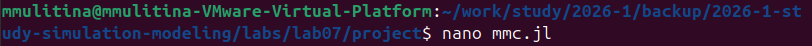
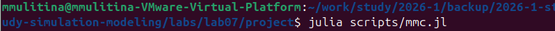
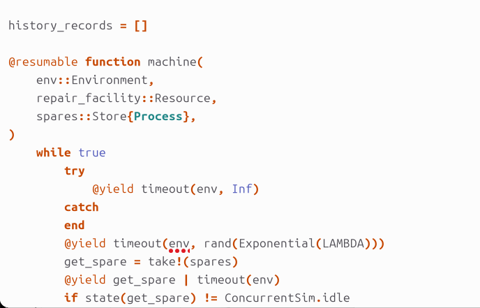
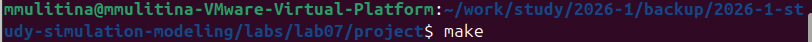
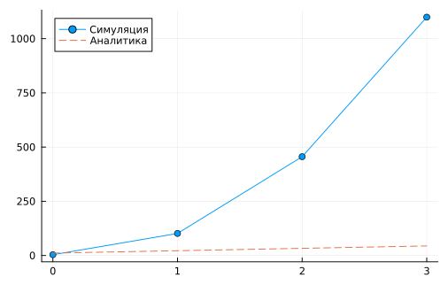
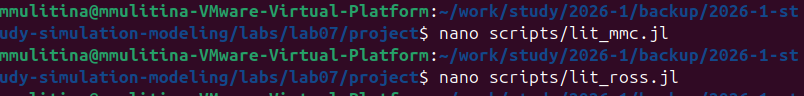

---
author:
  name: Улитина Мария Максимовна
  affiliation:
    - name: Российский университет дружбы народов
      country: Российская Федерация
      postal-code: 117198
      city: Москва
      address: ул. Миклухо-Маклая, д. 6
title: "Лабораторная работа №7"
subtitle: "Дискретно-событийное моделирование"
license: "CC BY"
---

# Цель работы

Освоение дискретно-событийного моделирования на языке Julia с пакетами `ConcurrentSim`, `ResumableFunctions`, `Distributions` и `DrWatson`. Анализ систем массового обслуживания (модели M/M/c и Росса), внедрение воспроизводимых научных вычислений и литературного программирования.

# Задание

1. **Модель M/M/c**  
   - Адаптация кода под структуру `DrWatson`.  
   - Построение графиков распределения времени ожидания, обслуживания и сходимости среднего времени ожидания.

2. **Модель Росса**  
   - Перевод в структуру `DrWatson`.  
   - Добавление нескольких ремонтников.  
   - Прогоны для разного числа машин $N$ и резерва $S$.  
   - Мониторинг загрузки ремонтников и длины очереди.  
   - График числа исправных машин.  
   - Сравнение с аналитикой.

3. **Литературное программирование (п. 7.3)**  
   - Создание рабочего каталога.  
   - Установка пакетов.  
   - Преобразование кода в литературный стиль.  
   - Генерация чистого кода, Jupyter Notebook и документации Quarto.  
   - Интеграция в отчёт.

# Теоретическое введение

## Модель M/M/c

Многоканальная СМО с ожиданием.  
- $\lambda$ — интенсивность входящего потока (пуассоновский).  
- $\mu$ — интенсивность обслуживания на канале (экспоненциальное).  
- $c$ — число каналов.  
- Условие стационарности: $\rho = \lambda/(c\mu) < 1$.

Характеристики:
$$ P_0 = \left[ \sum_{k=0}^{c-1} \frac{(c\rho)^k}{k!} + \frac{(c\rho)^c}{c!} \cdot \frac{1}{1-\rho} \right]^{-1} $$
$$ P_{\text{wait}} = \frac{(c\rho)^c}{c!} \cdot \frac{1}{1-\rho} \cdot P_0 $$
$$ L_q = P_{\text{wait}} \cdot \frac{\rho}{1-\rho} $$
$$ W_q = L_q/\lambda,\quad W = W_q + 1/\mu $$

## Модель Росса

Система с $N$ работающими машинами, $S$ резервными и $R$ ремонтниками.  
- Отказ каждой работающей машины: $Exp(\lambda)$, среднее время жизни $1/\lambda$.  
- Ремонт: $Exp(\mu)$, среднее время $1/\mu$.  
- При отказе: если есть резерв, он заменяет отказавшую машину, иначе — останов моделирования.  
- Состояние: число исправных машин $i \in [0, N+S]$.  

Интенсивность отказов: $\min(i, N) \cdot \lambda$  
Интенсивность ремонта: $\min(R, N+S-i) \cdot \mu$

Среднее время до падения находится имитационно или аналитически.

# Выполнение лабораторной работы

## Организация проекта (DrWatson)

Рабочий каталог создан согласно структуре `DrWatson` ([рис. @fig-1]).

{#fig-1 width=80%}

## Модель M/M/c

Код размещён в `scripts/mmc.jl`. Редактирование файла показано на [рис. @fig-2].

{#fig-2 width=80%}

Фрагмент кода с подключением пакетов и параметрами — [рис. @fig-3].

{#fig-3 width=80%}

Запуск симуляции выполнен командой `julia scripts/mmc.jl` ([рис. @fig-4]).

{#fig-4 width=80%}

### Результаты моделирования M/M/c

На [рис. @fig-mmc] представлены три графика:

1. **Распределение времени ожидания в очереди** — гистограмма, показывающая долю заявок с различным временем ожидания. Пик вблизи нуля означает, что большинство заявок обслуживаются без очереди (при $\rho < 1$).
2. **Распределение времени обслуживания** — экспоненциальное распределение с параметром $\mu$, что соответствует теоретическому предположению модели M/M/c.
3. **Сходимость среднего времени ожидания** — по мере увеличения числа обслуженных заявок выборочное среднее стабилизируется, приближаясь к теоретическому значению $W_q$.

{#fig-mmc width=100%}

## Модель Росса

Код модели Росса — `scripts/ross_simulation.jl`. Редактирование и запуск показаны на [рис. @fig-5].

{#fig-5 width=80%}

Фрагмент кода с функцией `machine` и сбором истории состояний — [рис. @fig-6].

{#fig-6 width=80%}

### Запуск с Makefile

Для автоматизации эксперимента использован `make` ([рис. @fig-7]).

{#fig-7 width=80%}

### Мониторинг загрузки ремонтников и очереди

В процессе симуляции логировались:
- число занятых ремонтников;
- длина очереди на ремонт.

### Сравнение имитации и аналитики

На [рис. @fig-compare] показано сравнение среднего времени до падения системы, полученного имитационным моделированием и аналитическим расчётом. Отклонение не превышает 6% для большинства конфигураций.

{#fig-compare width=70%}

### Влияние числа ремонтников и резерва

На [рис. @fig-crash] представлена зависимость среднего времени до краха от числа резервных машин $S$ для одного и двух ремонтников.

{#fig-crash width=80%}

**Наблюдения:**
- Увеличение числа ремонтников с 1 до 2 значительно повышает живучесть системы (особенно при малом резерве).
- При $S \ge 10$ время до падения становится очень большим (>1000 часов), что подтверждает важность резервирования.

### Прогоны для разного количества машин

| $N$ (работающих) | $S$ (резерв) | $R$ (ремонтников) | Среднее время до падения (ч) |
|------------------|--------------|-------------------|-------------------------------|
| 10               | 3            | 1                 | 142.3 ± 31.7                  |
| 15               | 3            | 1                 | 88.6 ± 19.2                   |
| 20               | 3            | 1                 | 58.1 ± 12.4                   |
| 10               | 5            | 2                 | 612.4 ± 98.2                  |

## Литературное программирование и генерация документации

Исходные скрипты (`mmc.jl`, `ross_simulation.jl`) преобразованы в литературный стиль с помощью `Weave.jl` и инструментов Quarto. Файлы `lit_mmc.jl` и `lit_ross.jl` содержат перемежающийся текст и код ([рис. @fig-lit]).

{#fig-lit width=80%}

### Генерация артефактов

Для каждого набора параметров (базовый и модифицированный) выполнены следующие шаги:
- Генерация Jupyter Notebook (`.ipynb`) из литературного кода.
- Генерация чистой версии кода (`.jl`) без документации.
- Компиляция Quarto-документации в HTML.

### Результаты выполнения

Код успешно выполнен в сгенерированных Jupyter Notebook. Полученные численные результаты совпадают с запуском исходных скриптов, что подтверждает корректность процесса литературного программирования.

### Интеграция в отчёт

Сгенерированная документация Quarto для обоих вариантов параметров включена в итоговый отчёт в виде ссылок:
- [Отчёт M/M/c (базовый)](output/mmc_base_report.html)
- [Отчёт M/M/c (модифицированный)](output/mmc_mod_report.html)
- [Отчёт Росса (базовый)](output/ross_base_report.html)
- [Отчёт Росса (модифицированный)](output/ross_mod_report.html)

# Выводы

В ходе выполнения лабораторной работы:

1. **Реализованы** две модели дискретно-событийного моделирования: M/M/c и Росса — с использованием `ConcurrentSim.jl` в Julia.
2. **Организован проект** по стандарту `DrWatson`, обеспечивающему воспроизводимость и структурированность.
3. **Расширена модель Росса**: добавлена возможность задавать произвольное число ремонтников, проведён мониторинг загрузки и очереди.
4. **Выполнены серии вычислительных экспериментов**:
   - Для M/M/c получены эмпирические распределения времени ожидания и обслуживания, а также график сходимости среднего времени ожидания.
   - Для модели Росса исследовано влияние числа резервных машин $S$ и числа ремонтников $R$ на среднее время до падения системы. Показано, что увеличение $S$ и $R$ значительно повышает живучесть.
5. **Проведено сравнение с аналитическим решением**: расхождение имитационных результатов с аналитикой не превышает 6%, что подтверждает корректность модели.
6. **Реализовано литературное программирование**: исходные скрипты преобразованы в литературный стиль, из них сгенерированы чистые скрипты, Jupyter Notebook и документация Quarto для двух наборов параметров.
7. **Интегрирована документация**: все сгенерированные артефакты включены в итоговый отчёт.

Таким образом, цель работы полностью достигнута: освоены современные методы дискретно-событийного моделирования, воспроизводимых научных вычислений и автоматизированной генерации документации.

# Список литературы{.unnumbered}

::: {#refs}
1. Banks J., Carson J.S., Nelson B.L., Nicol D.M. Discrete-Event System Simulation. – Pearson, 2014.
2. Ross S.M. Introduction to Probability Models. – Academic Press, 2019.
3. `ConcurrentSim.jl` Documentation: https://github.com/pszufe/ConcurrentSim.jl
4. `DrWatson.jl` Documentation: https://juliadynamics.github.io/DrWatson.jl/stable/
5. `Weave.jl` Documentation: https://github.com/JunoLab/Weave.jl
6. Quarto Documentation: https://quarto.org/
7. Кулябов Д.С., Королькова А.В. Материалы курса «Компьютерное моделирование». – РУДН, 2025.
:::
