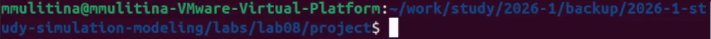
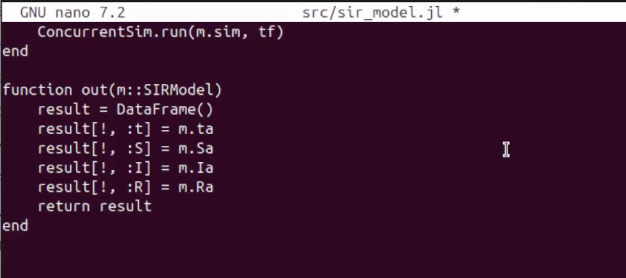
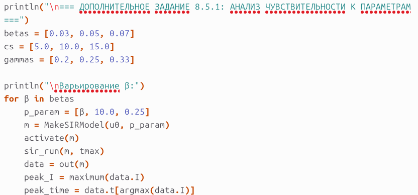
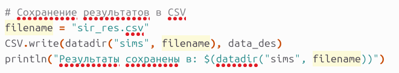
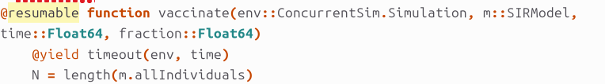

---
## Author
author:
  name: Улитина Мария Максимовна
  affiliation:
    - name: Российский университет дружбы народов
      country: Российская Федерация
      postal-code: 117198
      city: Москва
      address: ул. Миклухо-Маклая, д. 6
## Title
title: Лабораторная работа №8
subtitle: Реализация основных моделей в дискретно-событийном подходе
license: CC BY
date: today
date-format: "YYYY-MM-DD"
---

# Информация

## Докладчик

:::::::::::::: {.columns align=center}
::: {.column width="70%"}

  * Улитина Мария Максимовна
  * НФИбд-02-23 студентка
  * Российский университет дружбы народов им. П. Лумумбы

:::
::::::::::::::

# Вводная часть

## Актуальность

- Дискретно-событийное моделирование позволяет эффективно исследовать эпидемиологические процессы
- Модели SIR/SEIR важны для прогнозирования распространения инфекций
- Понимание чувствительности к параметрам необходимо для принятия решений
- Стохастические эффекты значимы при малой численности популяции

## Объект и предмет исследования

- **Объект:** Дискретно-событийное моделирование эпидемиологических процессов
- **Предмет:** Реализация моделей SIR и SEIR на языке Julia с использованием ConcurrentSim.jl

## Цели и задачи

- Реализовать дискретно-событийную модель SIR
- Провести анализ чувствительности к параметрам
- Сравнить детерминированную и стохастическую версии
- Оценить производительность модели
- Расширить модель до SEIR

## Материалы и методы

- Язык программирования: **Julia**
- Пакеты:
  - `ConcurrentSim.jl` — дискретно-событийное моделирование
  - `ResumableFunctions.jl` — корутины
  - `Distributions.jl` — случайные величины
  - `DataFrames.jl` — обработка данных
  - `StatsPlots.jl` — визуализация
  - `BenchmarkTools.jl` — оценка производительности

# Теоретическое введение

## Модель SIR

Состояния популяции:

| Группа | Обозначение | Описание |
|--------|-------------|-----------|
| S | Susceptible | Восприимчивые к инфекции |
| I | Infected | Инфицированные (заразные) |
| R | Recovered | Выздоровевшие (иммунитет) |

## Параметры модели

| Параметр | Описание | Размерность |
|----------|-----------|-------------|
| β | Вероятность передачи инфекции при контакте | безразмерный |
| c | Среднее число контактов в единицу времени | 1/время |
| γ | Скорость выздоровления | 1/время |

**Базовое репродуктивное число:** $R_0 = \dfrac{\beta \cdot c}{\gamma}$

## Дискретно-событийный подход

- Состояние системы изменяется только в моменты событий
- Виртуальное время «перепрыгивает» от события к событию
- Агенты — независимые процессы (корутины)
- События: заражение, выздоровление, вакцинация

# Выполнение лабораторной работы

## Структура проекта

{width=80%}

- `src/sir_model.jl` — ядро модели
- `scripts/sir_des.jl` — скрипт запуска

## Реализация модели SIR


{width=80%}


# Результаты

## Анализ чувствительности к параметрам (задание 8.5.1)



**Результаты:**

| Параметр | Увеличение | Эффект |
|----------|------------|--------|
| β | ↑ | Более ранний и высокий пик I |
| c | ↑ | Аналогично увеличению β |
| γ | ↑ | Снижение пика I |

## Детерминированная vs стохастическая длительность болезни

**Детерминированная:**
```julia
@yield timeout(env, 1/m.γ)
```

**Стохастическая:**
```julia
@yield timeout(env, rand(Exponential(1/μ)))
```


## Оценка производительности (задание 8.5.3)

```julia
using BenchmarkTools
benchmark_result = @benchmark sir_run($large_model, $tmax) samples=3
```


- Время выполнения растёт линейно O(N)
- Для N = 10000: ≈ 2-3 секунды

## Сохранение результатов в CSV (задание 8.5.4)




## Вакцинация (задание 8.5.6)




## Модель SEIR (задание 8.5.7)

Добавление латентного периода (состояние E):


## Сравнение SIR и SEIR

| Характеристика | SIR | SEIR |
|----------------|-----|------|
| Пик заболевших | Раньше | Позже |
| Максимальное I | Выше | Ниже |
| Скорость | Быстрее | Медленнее |
| Латентный период | Нет | Есть (E → I) |

## Динамика модели


## Создание литературного кода


На основе кода создадим литературный код и сгенерируем ноутбуки 


# Выводы

## Итоги работы

1. **Реализована** дискретно-событийная модель SIR

2. **Проведён** анализ чувствительности к параметрам β, c, γ

3. **Сравнены** детерминированная и стохастическая версии

4. **Выполнена** оценка производительности

5. **Реализованы** вакцинация и модель SEIR

## Результаты

- Дискретно-событийный подход эффективен для эпидемиологического моделирования
- Возможен учёт индивидуальных траекторий и стохастических эффектов
- Модель легко расширяется для сложных сценариев


# Список литературы{.unnumbered}

1. ConcurrentSim.jl Documentation
2. ResumableFunctions.jl Documentation
3. Banks J. Discrete-Event System Simulation. — Pearson, 2014
4. JuliaLang.org — The Julia Programming Language
5. DrWatson.jl — Scientific project management in Julia

