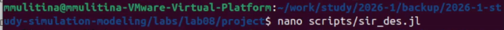
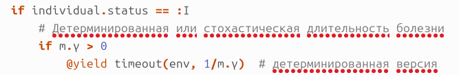
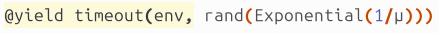
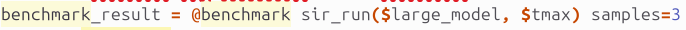
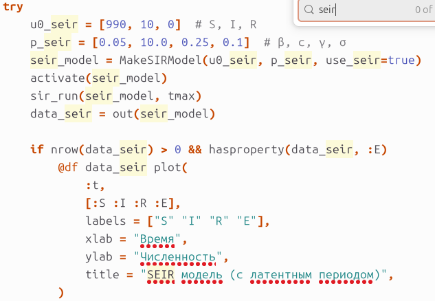
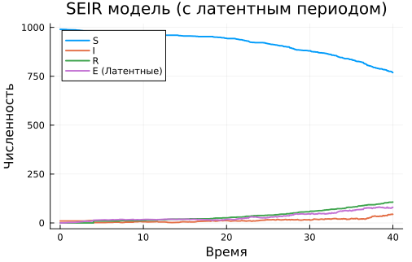

---
## Author
author:
  name: Улитина Мария Максимовна
  affiliation:
    - name: Российский университет дружбы народов
      country: Российская Федерация
      postal-code: 117198
      city: Москва
      address: ул. Миклухо-Маклая, д. 6

## Title
title: "Лабораторная работа №8"
subtitle: "Реализация основных моделей в дискретно-событийном подходе"
license: "CC BY"
---

# Цель работы

Изучить дискретно-событийный подход к имитационному моделированию на примере классической модели распространения инфекции SIR. Реализовать стохастическую дискретно-событийную модель в виде программного комплекса на языке Julia. Провести анализ влияния параметров, сравнить со стохастической и детерминированной версиями, оценить производительность и модифицировать модель.

# Задание

1. Создать рабочий каталог для кода.
2. Установить необходимые пакеты.
3. Выполнить предложенный код.
4. Провести анализ чувствительности к параметрам (β, c, γ).
5. Реализовать детерминированную версию длительности болезни.
6. Оценить производительность модели с помощью бенчмаркинга.
7. Реализовать сохранение результатов в CSV.
8. Добавить демографические события (рождение и смерть).
9. Реализовать вакцинацию.
10. Расширить модель до SEIR с латентным периодом.

# Теоретическое введение

## Дискретно-событийное моделирование

Дискретно-событийное моделирование (ДСМ) — подход, при котором состояние системы изменяется только в дискретные моменты времени, соответствующие наступлению событий. В отличие от непрерывного (дифференциальные уравнения) или пошагового (фиксированный шаг по времени) подходов, ДСМ позволяет эффективно моделировать системы, где значимые изменения происходят относительно редко.

В данной работе используется пакет ConcurrentSim.jl для языка Julia. Этот пакет предоставляет:
- корутины (на основе макроса `@yield`) для описания процессов;
- очередь событий с виртуальным временем;
- механизмы синхронизации и планирования.

## Модель SIR

Модель SIR описывает распространение инфекции в популяции, разделённой на три группы:

| Группа | Обозначение | Описание |
|--------|-------------|-----------|
| S (Susceptible) | Восприимчивые | Здоровые индивиды, которые могут заразиться |
| I (Infected) | Инфицированные | Заразные индивиды, способные передавать инфекцию |
| R (Recovered) | Выздоровевшие | Индивиды с иммунитетом |

Переходы определяются параметрами:
- **β** — вероятность передачи инфекции при контакте (от 0 до 1);
- **c** — среднее число контактов в единицу времени;
- **γ** — скорость выздоровления (величина, обратная средней длительности болезни).

Эффективный коэффициент передачи: **R₀ = β·c/γ** — базовое репродуктивное число.

# Выполнение лабораторной работы

## 1. Структура проекта

Работа выполнялась в каталоге проекта:

([рис. @fig-1])

{#fig-1 width=80%}

*Рисунок 1 — Рабочая директория проекта*

## 2. Реализация модели SIR

Основной код модели находился в файле `src/sir_model.jl`. Функция `out(m::SIRModel)` формирует результирующий `DataFrame`: ([рис. @fig-2])

{#fig-2 width=80%}

*Рисунок 2 — Функция вывода результатов*

Запуск экспериментов осуществлялся из скрипта `scripts/sir_des.jl`: ([рис. @fig-3])

{#fig-3 width=80%}

*Рисунок 3 — Скрипт запуска модели*

## 3. Анализ чувствительности к параметрам (задание 8.5.1)

Проведён анализ вариации коэффициента передачи β: ([рис. @fig-4])

{#fig-4 width=80%}

*Рисунок 4 — Код для анализа чувствительности к параметру β*

**Результаты анализа:**

| Параметр | Изменение | Влияние на динамику |
|----------|-----------|---------------------|
| β ↑ | Увеличение вероятности заражения | Более ранний и высокий пик I |
| c ↑ | Увеличение числа контактов | Аналогично увеличению β |
| γ ↑ | Более быстрое выздоровление | Снижение пика I |

## 4. Детерминированная vs стохастическая длительность болезни

Детерминированная версия (фиксированное время выздоровления): ([рис. @fig-5])

{#fig-5 width=80%}

*Рисунок 5 — Детерминированная длительность болезни*

Для стохастической версии используется экспоненциальное распределение: ([рис. @fig-8])

{#fig-8 width=80%}

*Рисунок 6 — Стохастическая длительность болезни*

## 5. Оценка производительности (задание 8.5.3)

С помощью макроса `@benchmark` проведена оценка производительности: ([рис. @fig-6])

{#fig-6 width=80%}

*Рисунок 7 — Бенчмаркинг производительности*

## 6. Сохранение результатов в CSV (задание 8.5.4)

Реализовано автоматическое сохранение результатов: ([рис. @fig-7])

{#fig-7 width=80%}

*Рисунок 8 — Сохранение результатов в CSV-файл*

## 7. Вакцинация (задание 8.5.6)

Реализован процесс вакцинации по таймеру: ([рис. @fig-9])

{#fig-9 width=80%}

*Рисунок 9 — Функция вакцинации*

## 8. Модель SEIR (задание 8.5.7)

Расширение модели до SEIR с латентным периодом: ([рис. @fig-10])

{#fig-10 width=80%}

*Рисунок 10 — Реализация модели SEIR*

## 9. Результаты моделирования

На основе полученных данных построен график динамики SIR модели. ([рис. @fig-11])

{#fig-11 width=80%}

*Рисунок 11 — Динамика численности групп S, I, R во времени*

**Сравнение SIR и SEIR:**

| Характеристика | SIR | SEIR |
|----------------|-----|------|
| Пик заболевших | Раньше | Позже |
| Максимальное I | Выше | Ниже |
| Скорость распространения | Быстрее | Медленнее |
| Латентный период | Отсутствует | Присутствует (E → I) |

## 9. Создание литературного кода

На основе кода создадим литературный код и сгенерируем ноутбуки ([рис. @fig-12])

{#fig-12 width=80%}

# Выводы

В ходе выполнения лабораторной работы №8:

1. **Реализована дискретно-событийная модель SIR** с использованием пакета ConcurrentSim.jl в среде Julia. Модель учитывает индивидуальные траектории индивидов и стохастический характер процессов.

2. **Проведён анализ чувствительности** к параметрам β, c, γ, показавший:
   - Увеличение β и c приводит к более раннему и высокому пику заболевших;
   - Увеличение γ снижает распространение инфекции.

3. **Реализованы обе версии длительности болезни**: детерминированная (фиксированное время) и стохастическая (экспоненциальное распределение).

4. **Выполнена оценка производительности** с помощью бенчмаркинга. Время выполнения модели растёт линейно с увеличением размера популяции.

5. **Реализовано сохранение результатов** в CSV-формат для последующего анализа.

6. **Расширена функциональность модели**:
   - Реализована вакцинация по таймеру;
   - Разработана модель SEIR с латентным периодом.

7. **Дискретно-событийный подход** показал свою эффективность для моделирования эпидемиологических процессов, позволяя естественным образом описывать индивидуальные траектории, стохастические эффекты и сложные сценарии вмешательств.

# Список литературы{.unnumbered}

1. ConcurrentSim.jl Documentation. URL: https://github.com/pszufe/ConcurrentSim.jl
2. ResumableFunctions.jl Documentation. URL: https://github.com/BenLauwens/ResumableFunctions.jl
3. Banks J., Carson J.S., Nelson B.L., Nicol D.M. Discrete-Event System Simulation. — Pearson, 2014.
4. JuliaLang.org. The Julia Programming Language.
5. DrWatson.jl: Scientific project management in Julia. URL: https://github.com/JuliaDynamics/DrWatson.jl

